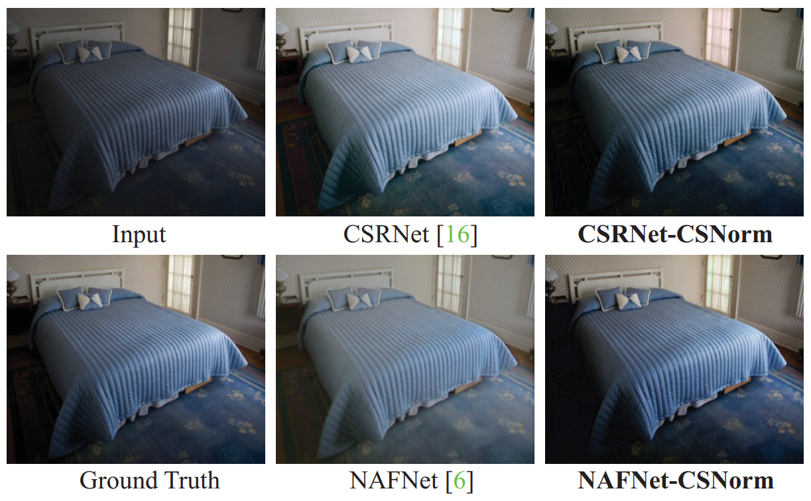

<div align="center">

# [ICCV 2023:fire:] Generalized Lightness Adaptation with Channel Selective Normalization.

[Mingde Yao](https://scholar.google.com/citations?user=fsE3MzwAAAAJ&hl=en)\*, [Jie Huang](https://huangkevinj.github.io/)\*, [Xin Jin](http://home.ustc.edu.cn/~jinxustc/), [Ruikang Xu](https://scholar.google.com/citations?user=PulrrscAAAAJ&hl=en), Shenglong Zhou, [Man Zhou](https://manman1995.github.io/), [Zhiwei Xiong](http://staff.ustc.edu.cn/~zwxiong/)

University of Science and Technology of China

Eastern Institute of Technology

Nanyang Technological University


[[`Paper`](https://arxiv.org/pdf/2308.13783.pdf)] [[`BibTeX`](#heart-citing-us)] :zap: :rocket: :fire:

[](https://github.com/pre-commit/pre-commit)
[](https://pytorch.org/get-started/locally/)
[](#license)

:rocket: Welcome! This is the official repository of [ICCV'23] Generalized Lightness Adaptation with Channel Selective Normalization. 

</div>


## 📌 Overview

>Lightness adaptation is vital to the success of image processing to avoid unexpected visual deterioration, which covers multiple aspects, e.g., low-light image enhancement, image retouching, and inverse tone mapping. Existing methods typically work well on their trained lightness conditions but perform poorly in unknown ones due to their limited generalization ability. To address this limitation, we propose a novel generalized lightness adaptation algorithm that extends conventional normalization techniques through a channel filtering design, dubbed Channel Selective Normalization (CSNorm). The proposed CSNorm purposely normalizes the statistics of lightness-relevant channels and keeps other channels unchanged, so as to improve feature generalization and discrimination. To optimize CSNorm, we propose an alternating training strategy that effectively identifies lightness-relevant channels. The model equipped with our CSNorm only needs to be trained on one lightness condition and can be well generalized to unknown lightness conditions. Experimental results on multiple benchmark datasets demonstrate the effectiveness of CSNorm in enhancing the generalization ability for the existing lightness adaptation methods. 


Overview of our proposed method. (a) Channel selective normalization (CSNorm), which consists of an instance-level normalization module and a differential gating module. (b) Differential gating module. It outputs a series of on-off switch gates for binarized channel selection in CSNorm. (c) Alternating training strategy. In the first step, we optimize the parameters outside CSNorm to keep an essential ability for lightness adaptation. In the second step, we only update the parameters inside the CSNorm (see (a)&(b)) with lightness-perturbed images. The two steps drive the CSNorm to select channels sensitive to lightness changes, which are normalized in $x_{n+1}$. 


<!--
## :star: News

* August. 18, 2023: We release the core code of our algorithm.
<!--, including the implementation of network architecture and training strategy.  ### Highlights
* More models and configurations will be open source soon, we need some time to organize our data and code. -->


##  :sunflower: Results



Visual comparisons of the generalized image retouching on the MIT-Adobe FiveK  dataset. The models are trained on the original dataset and tested on the unseen lightness condition.  


## :rocket: Usage

<!-- This repository is the **official implementation** of the paper, "Generalized Lightness Adaptation with Channel Selective Normalization", where more implementation details are presented. -->


To train the model equipped with CSNorm:

1. Modify the paths for training and testing in the configuration file (options/train/train_InvDN.yml).
2. Execute the command "python train.py -opt options/train/train_InvDN.yml".
3. Drink a cup of coffee or have a nice sleep.
4. Get the trained model. 


We employ the [NAFNet](https://github.com/mdyao/CSNorm/blob/62056d2ba45c6ab356a29e4a155d2f72c4c87beb/models/modules/NAFNet/NAFNet.py) as our base model, demonstrating the integration of CSNorm. 

Feel free to replace NAFNet with your preferred backbone when incorporating CSNorm:


1. Define the on-off switch gate function, where CHANNEL_NUM should be pre-defined.

```

class Generate_gate(nn.Module):
    def __init__(self):
        super(Generate_gate, self).__init__()
        self.proj = nn.Sequential(nn.AdaptiveAvgPool2d(1),
                                  nn.Conv2d(CHANNEL_NUM,CHANNEL_NUM, 1),
                                  nn.ReLU(),
                                  nn.Conv2d(CHANNEL_NUM,CHANNEL_NUM, 1),
                                  nn.ReLU())

        self.epsilon = 1e-8
    def forward(self, x):


        alpha = self.proj(x)
        gate = (alpha**2) / (alpha**2 + self.epsilon)

        return gate

def freeze(layer):
    for child in layer.children():
        for param in child.parameters():
            param.requires_grad = False


def freeze_direct(layer):
    for param in layer.parameters():
        param.requires_grad = False

```

2. Initialize CSNorm in the `__init__()` Method, where CHANNEL_NUM should be pre-defined.:

```
self.gate = Generate_gate()
for i in range(CHANNEL_NUM):
    setattr(self, 'CSN_' + str(i), nn.InstanceNorm2d(1, affine=True))
    freeze_direct(getattr(self, 'CSN_' + str(i)))
freeze(self.gate)
```

3. Integrate the Code in the `forward()` Method of Your Backbone, where CHANNEL_NUM should be pre-defined.

```
x = conv(x)
...
gate = self.gate(x)
lq_copy = torch.cat([getattr(self, 'CSN_' + str(i))(x[:,i,:,:][:,None,:,:]) for i in range(CHANNEL_NUM)], dim=1)
x = gate * lq_copy + (1-gate) * x
```


## :heart: Citing Us
If you find this repository or our work useful, please consider giving a star :star: and citation :t-rex:, which would be greatly appreciated:

```bibtex
@inproceedings{yao2023csnorm,
	title={Generalized Lightness Adaptation with Channel Selective Normalization},
	author={Mingde Yao, Jie Huang, Xin Jin, Ruikang Xu, Shenglong Zhou, Man Zhou, and Zhiwei Xiong},
	booktitle={Proceedings of the IEEE International Conference on Computer Vision},
	year={2023}
}
```


## :email: Contact

<!-- If you have any problem with the released code, please do not hesitate to open an issue.-->

For any inquiries or questions, please contact me by email (mdyao@mail.ustc.edu.cn). 
